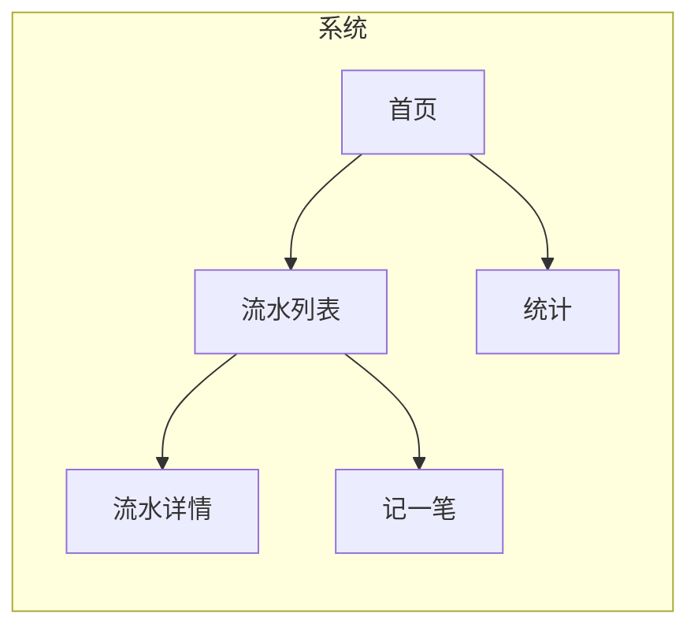
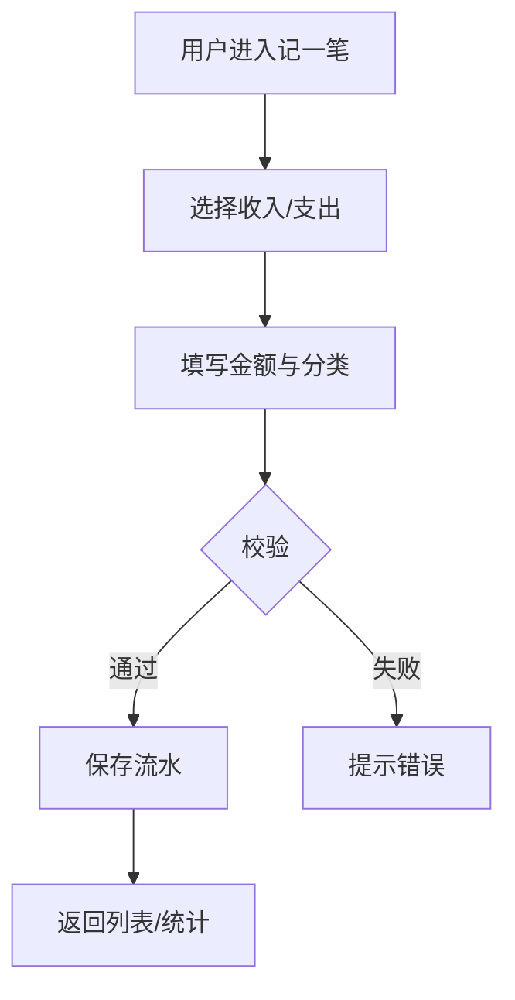
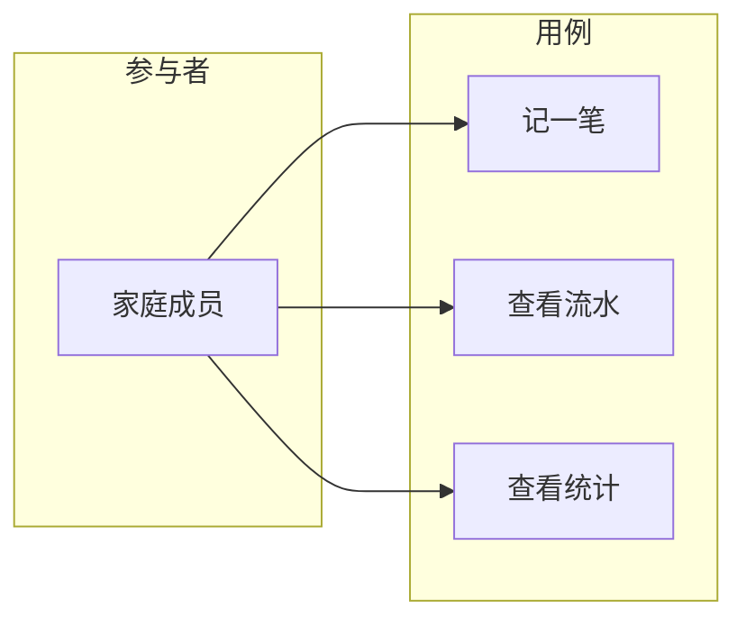

# Reference: PRD 模板与示例

## 存放路径与命名

- **路径**：`doc/产品方案/`（相对于项目根目录）。
- **文件名**：`YYYY-MM-DD_<产品或需求名称>-PRD.md`，例如 `2025-03-16_会话关闭功能-PRD.md`。

---

## 线框图（PRD 必选，优先产出）

PRD 撰写时须**先产出系统线框图**，再展开功能需求与详细原型，用于统一对产品形态与信息架构的理解。

- **目的**：表达系统包含哪些主要模块/页面、模块间关系、主导航与信息层级。
- **建议包含**：主要页面骨架（如首页、列表、详情、创建/编辑等）、关键区块与元素位置、主导航结构；多端需求需区分 Web/移动端并分别给出或标注。
- **形式**：线框图、页面结构草图、Mermaid 图（如 flowchart 表示页面/模块关系）或 ASCII 结构图；嵌入 PRD 并在正文中简要说明（模块/页面名称、对应职责）。
- **与后续内容一致**：功能需求、业务流程图、用例图及详细原型图应与线框图在范围和命名上保持一致。

**示例（Mermaid 页面结构）**：


---

## 业务流程图（PRD 必选）

PRD 须包含**业务流程图**，描述核心业务从触发到结束的步骤、分支与角色。

- **目的**：让技术方案设计能准确理解主流程、异常分支与涉及角色，便于拆解接口与状态。
- **建议包含**：主流程步骤（如：用户录入流水 → 选择分类 → 保存 → 列表展示）、分支（如：编辑/删除、筛选）、异常路径（如：校验失败、无权限）、涉及的参与者或系统。
- **形式**：Mermaid flowchart/sequence、BPMN 风格图或流程图截图；嵌入 PRD 并对图中节点与分支做简要说明。
- **与功能需求对应**：功能需求中的核心流程应在业务流程图中有对应节点；复杂业务可拆成多张图（如「记账流程」「统计流程」）。

**示例（Mermaid 业务流）**：


---

## 用例图（PRD 必选）

PRD 须包含**用例图**，表达参与者（角色）与用例（功能）的关系。

- **目的**：明确「谁能用哪些功能」，便于技术方案设计时做权限、角色与模块边界划分。
- **建议包含**：参与者（如：家庭成员、管理员）、用例（如：记一笔、查看统计、管理分类）、参与者与用例的关联；若有包含/扩展关系可一并画出（如「记一笔」包含「选择分类」）。
- **形式**：Mermaid（用 subgraph 或类似方式模拟参与者与用例）、PlantUML 用例图语法、或用例图截图；嵌入 PRD 并说明图例（角色、用例含义）。
- **与功能需求对应**：功能需求中的功能点应在用例图中有对应用例；优先级可在说明中标注。

**示例（Mermaid 风格用例关系）**：


---

## 原型图（PRD 必选内容）

在已有**线框图、业务流程图、用例图**的基础上，PRD 须包含**必要的详细原型图**，用于明确关键页面的界面与交互。

- **建议包含**：主要页面布局（列表页、详情页、创建/编辑页等）、核心操作流程（如提交、筛选、状态流转）、关键状态（正常态、空态、加载中、错误/无权限等）。多端需求需区分 Web/移动端等并分别给出或标注。
- **形式**：线框图细化、界面草图、截图+标注均可；图片嵌入 PRD（Markdown 引用本地或网络图片），或在文档中注明「见附件/链接」并在同仓库或可访问位置提供。正文中须对每张原型图做简要说明（页面/流程名称、对应功能点或用户故事）。
- **与功能需求对应**：功能需求中的关键功能点应在原型图中有体现；复杂流程可引用业务流程图并辅以页面串联说明。

---

## PRD 文档模板（可直接套用）

```markdown
# [产品/功能名称] 产品需求文档（PRD）

## 1. 产品/需求背景
- 为什么要做：……
- 解决什么问题：……
- 面向用户：……

## 2. 目标与范围
- **目标**：（一句话或 3～5 条）
- **范围**：本次包含的功能/模块；**不做什么**：……

## 3. 系统线框图（必选，优先产出）
- **系统结构**：（此处插入系统线框图，表达主要模块/页面、导航与信息架构；可 Mermaid/草图/截图。）
- **说明**：列明主要页面或模块名称、职责及与后续功能需求的对应关系。

## 4. 业务流程图（必选）
- **主流程**：（此处插入业务流程图，表达从触发到结束的步骤、分支与角色；可 Mermaid flowchart/sequence。）
- **说明**：简述主路径、关键分支与异常处理，与功能需求中的流程描述一致。

## 5. 用例图（必选）
- **参与者与用例**：（此处插入用例图，表达角色与功能的对应关系；可 Mermaid/PlantUML/截图。）
- **说明**：列明参与者、用例及简要含义，便于技术方案做权限与模块边界划分。

## 6. 用户与场景
- 用户角色：……
- 典型场景/用户故事：
  - 作为……，我希望……，以便……
  - …

## 7. 功能需求
| 序号 | 功能点 | 简要说明 | 优先级 |
|------|--------|----------|--------|
| 1 | …… | …… | P0/MVP |
| 2 | …… | …… | P1 |
| … | … | … | … |

（或按模块分小节列出，每项标注优先级；须与线框图、业务流程图、用例图一致。）

## 8. 原型图/界面说明（必选）
- **主要页面**：（此处插入或引用详细原型图，并简要说明：页面名称、主要元素、对应功能点。）
- **核心流程**：（如：创建/编辑流程、列表筛选流程；可引用业务流程图并补充页面串联说明。）
- **关键状态**：（如：空态、错误态；插入示意图并说明。）

## 9. 非功能需求
- 性能：……
- 安全/权限：……
- 兼容/多端：……
- 其他：……

## 10. 与现有功能的关系
- 全新功能 / 扩展 xxx 功能 / 改造 xxx；若改造，兼容要点：……

## 11. 验收标准（可选）
- 完成标准：……
- 可验收条款：……
```

---

## 与 design-technical-solution 的衔接说明

- **design-technical-solution** 以本 PRD 为输入后，会先提出至少 10 个与设计技术方案相关的问题（业务边界、优先级、涉及模块/领域、接口约定、非功能要求等），再产出技术方案。
- PRD 中若已写明**目标与范围、线框图/业务流程图/用例图、功能需求及优先级、非功能需求、与现有功能关系**，将减少反复澄清，便于技术方案设计时直接拆解为「模块变更清单」与「实现顺序」。
- **线框图**帮助确定页面/模块边界，**业务流程图**帮助确定接口与状态设计，**用例图**帮助确定角色与权限边界。
- 复杂 PRD（多模块、多流程）会在技术方案设计阶段被拆解为低耦合子需求，每份子需求对应一份技术方案；PRD 中的**优先级**与**功能点划分**有助于拆解时的边界划分。

---

## 示例：会话关闭功能 PRD（精简）

```markdown
# 会话关闭功能 PRD

## 1. 背景
用户需要主动结束某次对话，避免会话列表过长；关闭后的会话可保留查看但不再接受新消息。

## 2. 目标与范围
- **目标**：支持用户关闭指定会话，关闭后会话状态变更且前端可区分展示。
- **范围**：本次仅做「关闭」能力；不包含归档、恢复、自动关闭规则。

## 3. 系统线框图（必选）
- 会话模块在系统中的地位：会话列表 → 会话详情；列表项含「关闭」入口。
- （插入 Mermaid 或草图：首页/会话列表/会话详情的结构关系。）

## 4. 业务流程图（必选）
- 主流程：用户打开会话列表 → 点击某会话的「关闭」→ 确认 → 会话状态变为已关闭 → 列表刷新区分展示。
- （插入 Mermaid flowchart 表示上述步骤与分支。）

## 5. 用例图（必选）
- 参与者：用户。用例：查看会话列表、关闭会话、查看已关闭会话。
- （插入用例图，表达用户与上述用例的关联。）

## 6. 用户与场景
- 作为用户，我希望在会话列表中点击「关闭」后，该会话被标记为已关闭，以便列表更清晰。

## 7. 功能需求
| 序号 | 功能点 | 优先级 |
|------|--------|--------|
| 1 | 会话支持「关闭」操作，关闭后状态为已关闭 | P0 |
| 2 | 已关闭会话在列表中可区分展示（如置底或标签） | P1 |

## 8. 原型图（必选）
- 会话列表页：展示「关闭」入口，已关闭会话与进行中会话区分展示（可草图或标注现有列表）。
- 关闭后状态：列表项状态变化说明或示意图。

## 9. 非功能需求
- 关闭操作需记录操作人、操作时间（若现有审计体系支持）。

## 10. 与现有功能的关系
- 扩展现有「会话」模块；需兼容现有会话列表与详情接口（只读 closed 状态即可）。
```

上述 PRD 交付 **design-technical-solution** 后，可产出「会话关闭」技术方案（domain 增加 close、application 增加 closeConversation、adapter 增加 close 接口等）。
