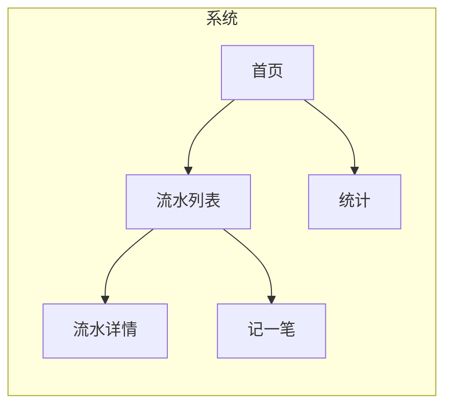
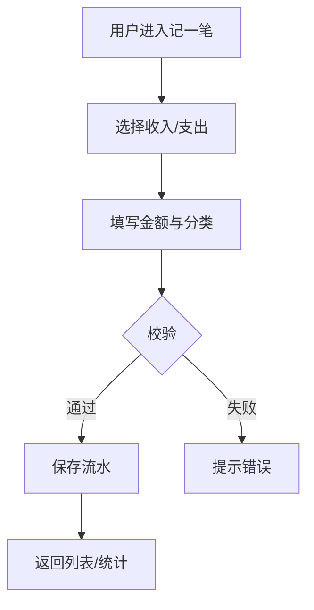
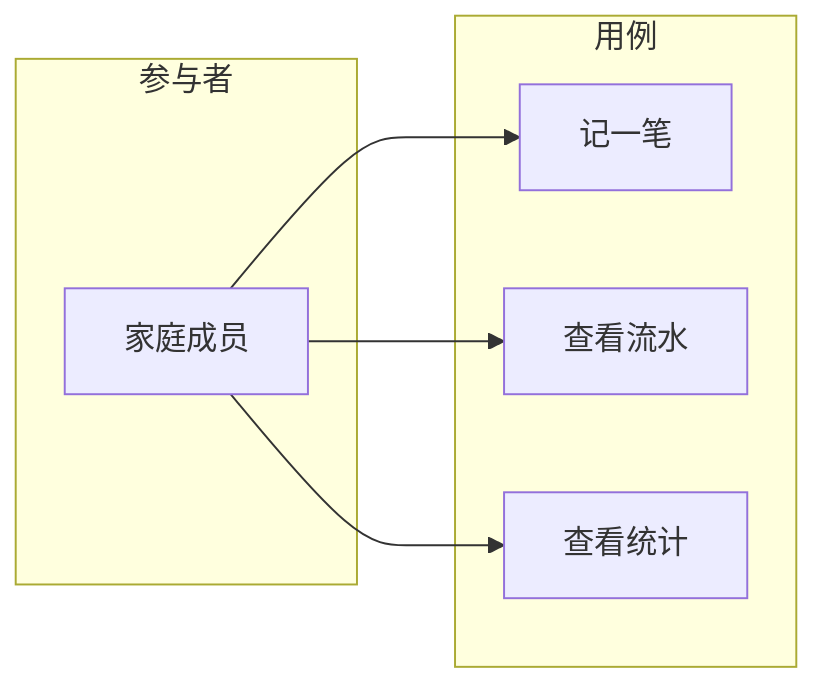

# Wireframes, Flowcharts, and Diagrams

## Wireframe（线框图）

PRD 撰写时须**先产出系统线框图**，再展开功能需求与详细原型。

- **目的**：表达系统包含哪些主要模块/页面、模块间关系、主导航与信息层级。
- **建议包含**：主要页面骨架（如首页、列表、详情、创建/编辑等）、关键区块与元素位置、主导航结构；多端需求需区分 Web/移动端并分别给出或标注。
- **形式**：线框图、页面结构草图、Mermaid 图（如 flowchart 表示页面/模块关系）或 ASCII 结构图；嵌入 PRD 并在正文中简要说明（模块/页面名称、对应职责）。
- **与后续内容一致**：功能需求、业务流程图、用例图及详细原型图应与线框图在范围和命名上保持一致。

**示例（Mermaid 页面结构）**：

---

## 业务流程图（Business Flow Diagram）

PRD 须包含**业务流程图**，描述核心业务从触发到结束的步骤、分支与角色。

- **目的**：让技术方案设计能准确理解主流程、异常分支与涉及角色，便于拆解接口与状态。
- **建议包含**：主流程步骤（如：用户录入流水 → 选择分类 → 保存 → 列表展示）、分支（如：编辑/删除、筛选）、异常路径（如：校验失败、无权限）、涉及的参与者或系统。
- **形式**：Mermaid flowchart/sequence、BPMN 风格图或流程图截图；嵌入 PRD 并对图中节点与分支做简要说明。
- **与功能需求对应**：功能需求中的核心流程应在业务流程图中有对应节点；复杂业务可拆成多张图（如「记账流程」「统计流程」）。

**示例（Mermaid 业务流）**：

---

## 用例图（Use Case Diagram）

PRD 须包含**用例图**，表达参与者（角色）与用例（功能）的关系。

- **目的**：明确「谁能用哪些功能」，便于技术方案设计时做权限、角色与模块边界划分。
- **建议包含**：参与者（如：家庭成员、管理员）、用例（如：记一笔、查看统计、管理分类）、参与者与用例的关联；若有包含/扩展关系可一并画出（如「记一笔」包含「选择分类」）。
- **形式**：Mermaid（用 subgraph 或类似方式模拟参与者与用例）、PlantUML 用例图语法、或用例图截图；嵌入 PRD 并说明图例（角色、用例含义）。
- **与功能需求对应**：功能需求中的功能点应在用例图中有对应用例；优先级可在说明中标注。

**示例（Mermaid 风格用例关系）**：

---

## 原型图（Mockups/Prototypes）

在已有**线框图、业务流程图、用例图**的基础上，PRD 须包含**必要的详细原型图**，用于明确关键页面的界面与交互。

- **建议包含**：主要页面布局（列表页、详情页、创建/编辑页等）、核心操作流程（如提交、筛选、状态流转）、关键状态（正常态、空态、加载中、错误/无权限等）。多端需求需区分 Web/移动端等并分别给出或标注。
- **形式**：线框图细化、界面草图、截图+标注均可；图片嵌入 PRD（Markdown 引用本地或网络图片），或在文档中注明「见附件/链接」并在同仓库或可访问位置提供。正文中须对每张原型图做简要说明（页面/流程名称、对应功能点或用户故事）。
- **与功能需求对应**：功能需求中的关键功能点应在原型图中有体现；复杂流程可引用业务流程图并辅以页面串联说明。
