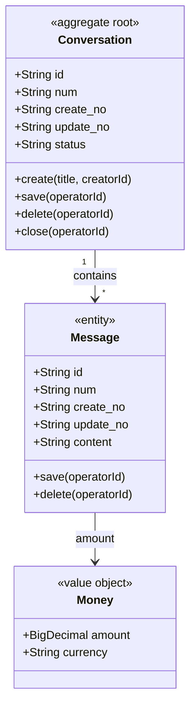

# Reference: 技术方案文档模板与 Skill 映射

## 存放路径与命名

- **路径**：`doc/技术方案/`（相对于项目根目录）。
- **文件名**：`YYYY-MM-DD_<功能或需求名称>-技术方案.md`，例如 `2025-03-16_会话关闭-技术方案.md`。多份子需求方案均放在该目录下并各自加日期前缀。

---

## 技术方案设计前必问问题清单（至少 10 个）

在编写技术方案前，须向使用者提出至少 10 个与设计技术方案相关的问题。以下为示例，可按 PRD 内容增删或改写，确保不少于 10 个且覆盖关键设计决策。

1. **业务边界**：本需求的核心业务目标是什么？哪些在本次范围内，哪些明确不做？
2. **优先级**：PRD 中若有多个功能点，实现优先级顺序如何？是否有 MVP 与后续迭代的划分？
3. **涉及模块/领域**：会涉及哪些业务领域或现有模块（如用户、订单、会话等）？是否有新增领域？
4. **与现有功能的关系**：是全新功能还是对现有功能的扩展/改造？若是改造，哪些接口或数据需要兼容？
5. **关键实体与状态**：核心业务实体有哪些？有哪些关键状态或生命周期需要落库或驱动流程？
6. **接口约定**：对外是否需要新 API？请求/响应格式是否有统一要求（如 REST 路径规范、Result 结构）？
7. **数据与存储**：是否有新增表或字段？是否依赖外部系统或第三方服务？
8. **安全与权限**：是否需要鉴权、操作人追溯、敏感数据脱敏等？与现有认证体系如何衔接？
9. **非功能要求**：是否有性能、并发、限流、审计、日志等要求？
10. **上线与兼容**：是否有灰度、回滚、数据迁移或对老接口的兼容要求？

可根据 PRD 补充更多问题，例如：错误码与多语言、前端/多端约定、定时任务与事件、Agent/流式输出等。

---

## 领域模型设计：领域类图与领域动作

技术方案中**领域模型设计**为必选内容，须包含 **SKILL.md** 中规定的全部子项（聚合与边界、领域对象分类、领域类图、不变性与业务规则、领域动作、领域事件清单），并符合下述规范与 **领域对象设计规范（专业版）**。

### 领域模型基本属性与必备动作（强制）

- **基本属性（聚合根与实体必选）**：每个**聚合根**与**实体**必须拥有以下四个属性，在领域类图与数据库表中须显式体现：
  - **id**：唯一标识；**技术方案中数据库表主键 `id` 须为 `BIGINT` 自增**（见「数据库设计模块」），领域/Java 中建议 **`Long`**。若历史方案仍写 `String id`，须在落库时与 `BIGINT` 主键二选一迁移，**新方案以 `Long` + BIGINT 为准**。
  - **num**：业务编号/序号，用于对外展示或业务去重。
  - **create_no**：创建人标识（如 userId），记录是谁创建。
  - **update_no**：更新人标识（如 userId），记录最后是谁更新。
- **值对象**无需上述属性，仅由业务属性组成。
- **必备领域动作**：每个聚合根及具备持久化生命的实体必须具备：
  - **save(…, operatorId)**：保存或更新当前聚合/实体状态；入参必须包含操作人（如 operatorId）。
  - **delete(…, operatorId)**：逻辑删除或物理删除；入参必须包含操作人。
- **操作人参数**：**所有**领域动作（含 save、delete 及其它业务动作）的方法签名**必须包含操作人参数**（如 operatorId、createNo、updateNo），用于审计与追溯。

### 领域类图

- **目的**：表达聚合根、实体、值对象之间的**静态结构**（类名、属性类型、关联）。
- **建议内容**：每个聚合一张类图或合并为领域总图；标出 **<<aggregate root>>**、**<<entity>>**、**<<value object>>**；**聚合根与实体须画出 id、num、create_no、update_no**，并标出 **save(…)、delete(…)** 及操作人参数；聚合之间仅画** ID 引用**（如 `bookId: String`），不画对象引用；值对象类型（如 Money、DateRange）须在图中出现；若有继承/组合关系一并画出。
- **形式**：Mermaid `classDiagram`、PlantUML 类图、或结构化文字（类名 + 属性列表 + 类型 + 关联说明），嵌入文档并附简短说明。

**Mermaid 示例**（聚合根/实体含基本属性与 save/delete，领域动作含操作人参数）：



### 领域动作

- **目的**：明确聚合根及关键实体的**行为方法**（领域动作），避免贫血模型；与 application 层「编排」区分开，领域动作内封装业务规则与不变性。
- **强制约定**：
  - 每个聚合根及具备持久化生命的实体**必须**有 **save(…, operatorId)**、**delete(…, operatorId)** 两个领域动作。
  - **所有**领域动作的入参**必须包含操作人参数**（如 operatorId），用于追溯谁执行了该动作。
- **建议内容**：按聚合根/实体列出：
  - **方法签名**：方法名、入参（**含操作人参数**、其它业务参数）、返回值；
  - **职责**：该方法完成的业务含义（用业务语言描述）；
  - **前置条件 / 后置条件**：调用前必须满足的条件、调用后聚合状态满足的不变性；
  - **业务规则与校验**：金额>0、状态仅允许某几种流转、权限校验等；
  - **领域事件**：事件名、触发时机、载荷字段；
  - **依赖**：若需读取外部数据（如校验家庭存在），注明依赖的 Repository/Gateway 接口名。
- **与模块变更一致**：领域动作应在「模块变更清单」的 domain 变更中有对应。

**领域动作时序逻辑**：对关键业务领域动作（非纯 save/delete），技术方案须写出**时序逻辑**——方法内部步骤顺序、调用的 Repository/Gateway 及时机、事件发布时机。示例（create 时序）：1. 校验入参（name、ownerId 非空）2. 通过 UserRepository 校验 ownerId 存在 3. 生成 id、num、create_no 4. 构造聚合根并加入 FamilyMember(ownerId, owner) 5. 调用 Repository.save 6. 发布 FAMILY_CREATED 事件。可用有序列表或 Mermaid sequenceDiagram（Service→Aggregate→Repository→EventPublisher）表达。

**示例（领域动作列表，含操作人参数与前置/后置条件）**：

| 聚合/实体 | 领域动作 | 职责 | 前置条件 | 后置条件/规则 | 领域事件 |
|-----------|----------|------|----------|----------------|----------|
| Conversation | save(operatorId) | 保存/更新会话状态 | operatorId 有效 | create_no/update_no 已更新 | — |
| Conversation | delete(operatorId) | 逻辑/物理删除会话 | operatorId 有权限 | 已标记删除或物理删除 | CONVERSATION_DELETED |
| Conversation | create(title, creatorId) | 创建会话，设置创建人 | creatorId 对应用户存在 | status=OPEN；id、num、create_no 已生成 | CONVERSATION_CREATED |
| Conversation | close(operatorId) | 关闭会话 | status=OPEN；operatorId 有权限 | status=CLOSED | CONVERSATION_CLOSED |
| Message | save(operatorId) | 保存/更新消息 | operatorId 有效 | update_no 已更新 | — |
| Message | delete(operatorId) | 删除消息 | operatorId 有权限 | 已标记删除或物理删除 | — |
| Message | append(conversationId, content, senderId) | 追加消息（senderId 即操作人） | 会话未关闭；senderId 为成员 | 消息已加入聚合 | MESSAGE_APPENDED |

---

## 领域对象设计规范（专业版）

技术方案中的领域模型设计须符合以下规范，以保证领域对象设计**专业、可落码、易维护**。

### 1. 聚合与边界

- **聚合（Aggregate）**：一组具有内聚业务含义的对象（聚合根 + 实体 + 值对象），作为**一致性边界**；一次事务内只修改**一个**聚合，避免跨聚合事务。
- **聚合根（Aggregate Root）**：聚合的入口，外部仅通过聚合根 ID 引用该聚合；聚合根负责维护聚合内**不变性**（Invariants），并发布领域事件。
- **边界划分原则**：按业务不变性划分；聚合尽量**小**，避免大聚合导致锁与性能问题；跨聚合协作通过**领域事件**或 application 层编排（先查 A 再调 B 的领域动作），不跨聚合直接引用对象。

### 2. 领域对象分类与基本属性

| 类型 | 定义 | 识别要点 | 基本属性（强制） | 必备领域动作 | 示例 |
|------|------|----------|------------------|--------------|------|
| **聚合根** | 聚合入口，有唯一 ID，负责不变性与领域事件 | 生命周期独立、被外部通过 ID 引用 | id、num、create_no、update_no | save(operatorId)、delete(operatorId) | User、Order、Conversation |
| **实体（Entity）** | 有唯一 ID，属于某聚合，可有生命周期 | 在聚合内通过 ID 区分不同对象 | id、num、create_no、update_no | save(operatorId)、delete(operatorId) | OrderItem、FamilyMember、Message |
| **值对象（Value Object）** | 无独立 ID，由属性值整体定义同一性；**不可变** | 可替换、可相等比较、无独立生命周期 | 无（仅业务属性） | 无 | Money、DateRange、Address、CategoryId |

- **值对象使用场景**：金额（Money）、日期范围（DateRange）、枚举型分类（如收支类型）、简短业务标识（如商户名、备注摘要）；能显著减少实体属性膨胀并集中校验逻辑。
- **所有领域动作**（含 save、delete 及其它业务方法）**必须包含操作人参数**（如 operatorId），便于审计与追溯。

### 3. 不变性与业务规则

- **不变性（Invariants）**：聚合在任意时刻都应满足的条件，如「订单金额 = 各明细金额之和」「账本必须归属已存在的家庭」。在领域动作的**后置条件**中写明。
- **业务规则**：在领域动作描述中明确写出**校验规则**（前置条件）与**状态/数据规则**（后置条件）；违反时以**领域异常**（如 InvalidStateException）或返回值（如 Result）表达，不在领域层吞掉错误。
- **谁负责校验**：聚合根在领域动作内校验聚合内数据；**跨聚合存在性**（如 bookId 对应账本是否存在）可由 application 层先查再调领域动作，或聚合根依赖 Repository 接口做存在性校验（实现在 infra）。

### 4. 领域动作设计要点

- **必备动作**：每个聚合根及具备持久化生命的实体**必须**提供 **save(…, operatorId)**、**delete(…, operatorId)**；其它业务动作按需设计。
- **操作人参数**：**所有**领域动作的入参**必须包含操作人**（如 operatorId、createNo、updateNo），用于追溯「谁」执行了该动作；create 类动作可用 creatorId 兼作操作人，但仍建议统一为 operatorId 或显式注明。
- **命名**：使用**业务语言**（ubiquitous language），与 PRD/产品术语一致，如 `record(…)`、`close(…)`、`inviteMember(…)`。
- **入参**：优先使用**值对象**或**基本类型**，避免传入大而全的 DTO；必要时可传入其他聚合的 **ID**（如 bookId、accountId），由聚合根内部或依赖 Repository 校验。
- **出参**：返回聚合根/实体自身、或 void；若需返回多字段，可返回值对象或领域内 DTO，避免直接返回 infra 的 Entity。
- **副作用**：领域动作内可更新聚合状态、发布领域事件；**不**在领域层直接调用外部 HTTP、消息队列等（通过 Gateway 接口由 infra 实现）。

### 5. 领域事件设计

- **何时发布**：在聚合根完成**状态变更或关键业务事实**后发布，如「订单已创建」「会话已关闭」；用于跨聚合解耦、审计、或下游订阅。
- **命名**：过去式、业务含义明确，如 `ORDER_CREATED`、`CONVERSATION_CLOSED`；与 facade 层 DomainEventDTO 或事件常量一致。
- **载荷**：包含**事件唯一标识、聚合根 ID、关键属性、发生时间**等；尽量少带敏感信息，必要时只带 ID 由订阅方再查。
- **清单**：在技术方案中列出**领域事件清单**（事件名、触发时机、载荷字段、可选订阅方），便于 impl-facade-module 与 impl-domain-module 对齐。

### 6. 跨聚合引用与 Gateway

- **跨聚合**：只持有**聚合根 ID**（如 `bookId`、`familyId`），不持有对方聚合根或实体的对象引用；通过 ID 在 application 层或 infra 层再查。
- **Gateway**：当领域动作需要依赖**外部能力**（如调用大模型、调用微信接口、读取配置）时，在 domain 层定义 **Gateway 接口**（如 CategorySuggestGateway、WechatAuthGateway），由 infra 实现；领域动作只依赖接口，不依赖具体实现。

### 7. 领域模型专业度自检清单

撰写完领域模型设计后，可对照以下清单自检：

- [ ] 每个**聚合根**与**实体**已具备**基本属性**：id、num、create_no、update_no（值对象无需）。
- [ ] 每个聚合根及具备持久化生命的实体已具备 **save(…, operatorId)**、**delete(…, operatorId)** 两个领域动作。
- [ ] **所有**领域动作的入参均包含**操作人参数**（如 operatorId）。
- [ ] 每个聚合已明确**聚合根**，且边界内仅一个聚合根。
- [ ] 聚合之间仅通过** ID 引用**，无对象引用；跨聚合协作通过事件或 application 编排。
- [ ] **值对象**已识别并画出（金额、日期范围、枚举型等），避免全部用基本类型。
- [ ] 每个聚合根列出了**不变性**及**关键业务规则**。
- [ ] 领域动作均包含**前置条件/后置条件**或等价业务规则描述，且注明了**领域事件**。
- [ ] **关键领域动作**已写出**时序逻辑**（内部步骤顺序、Repository/Gateway 调用时机、事件发布时机）。
- [ ] **领域事件清单**已列出，事件名与载荷与 facade/domain 约定一致。
- [ ] 命名与 PRD/业务术语一致（**统一语言**），无技术实现细节泄露（如 avoid 表名、字段名直接当类名）。

---

## 应用层设计：Service 方法与时序逻辑

技术方案若涉及 **application 层**，须设计出各 Service 的**方法清单**与**各方法的时序逻辑**，便于 impl-application-module 按步骤落码。

### Service 方法清单

- **内容**：按 Service 类（如 UserRegisterCommandService、FamilyCommandService、TransactionQueryService）列出：
  - **方法签名**：方法名、入参类型（Param 或基本类型）、返回值类型（Result\<VO\>、void、Long 等）。
  - **职责**：一句话说明该方法完成的业务用例（如「用户注册」「创建家庭」「记一笔」）。
  - **入参/出参**：关键字段或引用 Param/VO 名称。
- **形式**：表格（Service | 方法 | 职责 | 入参 | 出参）或结构化列表。

### 方法时序逻辑

- **内容**：对每个 Service 方法写出**执行步骤顺序**，明确与 domain、infra 的协作关系。建议步骤模板：
  1. **参数校验**：非空、格式、业务规则（或委托 domain 校验）。
  2. **解析操作人/鉴权**：从上下文取 operatorId、校验权限（或由 adapter 层传入）。
  3. **加载聚合/查询**：调用 Repository.findById、Repository.list 或 Gateway。
  4. **调用领域动作或 Gateway**：如 aggregate.create(...)、aggregate.record(...)、CategorySuggestGateway.suggest(...)。
  5. **持久化/发布事件**：Repository.save、DomainEventPublisher.publish；事务边界在此标明（如「本方法 @Transactional」）。
  6. **组装返回**：构造 VO、Result 返回。
- **形式**：有序列表、步骤表（方法 | 步骤序号 | 步骤描述 | 依赖/调用），或 **Mermaid sequenceDiagram**（Controller→Service→Domain/Repository→EventPublisher）。
- **跨 Service 调用**：若 A 方法内调用 B Service，在时序中写明步骤「调用 BService.xxx(...)」，并注明事务边界（同事务或新事务）。

**示例（FamilyCommandService.createFamily 时序逻辑）**：

| 步骤 | 描述 | 依赖/调用 |
|------|------|-----------|
| 1 | 参数校验：name 非空，ownerId 非空 | — |
| 2 | 操作人：operatorId 从请求上下文取得，与 ownerId 一致或为管理员 | — |
| 3 | 校验 ownerId 对应用户存在 | UserRepository.findById(ownerId) |
| 4 | 创建家庭聚合：Family.create(name, ownerId) | FamilyFactory 或 new + FamilyMember |
| 5 | 持久化并发布事件 | FamilyRepository.save；DomainEventPublisher.publish(FAMILY_CREATED) |
| 6 | 返回家庭 id 或 FamilyVO | Result\<String\> 或 Result\<FamilyVO\> |

---

## 控制器设计：接口与时序逻辑

技术方案若涉及 **adapter 层**，须设计出各 Controller 的**接口清单**与**各接口的时序逻辑**，便于 impl-adapter-module 按步骤落码。

### Controller 接口清单

- **内容**：按 Controller（如 AuthController、FamilyCommandController、TransactionQueryController）列出：
  - **HTTP 方法 + 路径**：如 POST /api/auth/register、GET /api/family/query/list。
  - **入参**：请求体类型（Param）、路径/查询参数；是否需鉴权（Bearer Token）。
  - **返回值**：Result\<VO\>、Result\<List\<VO\>\> 等。
  - **职责**：对应哪个用例或 Service 方法（如「调用 UserRegisterCommandService.register」）。
- **形式**：表格（路径 | 方法 | 入参 | 出参 | 职责）或与「接口与数据契约」合并。

### 接口时序逻辑

- **内容**：对每个 HTTP 接口写出**请求处理步骤顺序**，明确与 application 层、鉴权、异常处理的协作。建议步骤模板：
  1. **接收请求**：反序列化请求体/参数，绑定 Param。
  2. **鉴权与操作人**：校验 JWT、取当前 userId 作为 operatorId（若需）；未登录则 401。
  3. **参数校验**：基础校验（非空、格式）或交给 Service 做业务校验。
  4. **调用 Application 层**：调用对应 CommandService/QueryService 方法，传入 Param 与 operatorId。
  5. **封装返回**：将 Service 返回值封装为 Result.success(data)；异常映射为 Result.fail(错误码) 或统一异常处理。
- **形式**：有序列表、步骤表（接口 | 步骤序号 | 步骤描述），或 **Mermaid sequenceDiagram**（Client→Controller→Service）。
- **异常与错误码**：可注明「参数错误→400/INVALID_PARAM」「未授权→401/UNAUTHORIZED」「无权限→403/FORBIDDEN」「业务异常→200+业务错误码」等映射规则。

**示例（POST /api/family/command/create 时序逻辑）**：

| 步骤 | 描述 | 说明 |
|------|------|------|
| 1 | 接收请求体 CreateFamilyParam，绑定 name、ownerId | @RequestBody |
| 2 | 鉴权：校验 JWT，取当前 userId；若 ownerId 与 userId 不一致可校验是否为管理员 | 未登录 401 |
| 3 | 参数校验：name、ownerId 非空 | 不合格 400 |
| 4 | 调用 FamilyCommandService.createFamily(param, operatorId) | 传入当前用户为 operatorId |
| 5 | 返回 Result.success(familyId) 或 Result.success(FamilyVO) | 异常由 GlobalExceptionHandler 映射为 Result.fail |

---

## 数据库设计模块

技术方案中**数据库设计**为必选模块，便于 impl-infra-module 落表与 Mapper。

### 主键 `id` 约定（强制）

- **类型与生成策略**：每张表的主键字段名 **`id`** 必须为 **`BIGINT NOT NULL`**，且使用 **数据库自增**（MySQL：`AUTO_INCREMENT`；其它库用等价自增/identity）。
- **DDL 示例**：

```sql
id BIGINT NOT NULL AUTO_INCREMENT PRIMARY KEY
```

- **与 `num` 分工**：**业务对外编号、幂等、展示** 使用独立字段 **`num`**（如 `VARCHAR`）及 **唯一索引 `UNIQUE KEY uk_xxx_num (num)`**；**不要用字符串 UUID 当物理主键**（除非该表非业务主表且技能另有约定）。
- **外键/关联列**：引用他表主键时，关联列类型与主键一致，使用 **`BIGINT`**（如 `user_id BIGINT NOT NULL`）。
- **领域/Java 映射**：持久化主键在领域类图与 Infra Entity 中建议类型 **`Long`**，与 `BIGINT` 一致。

### 时间字段 `create_time` / `update_time` 约定（强制）

- **命名**：记录创建时间、最后更新时间的列名**必须**分别为 **`create_time`**、**`update_time`**。**禁止**在技术方案 DDL 与表结构中使用 **`created_at`、`updated_at`** 或其它命名（与既有老表并存时，新表、新方案仍以本约定为准；历史表迁移另文说明）。
- **精度**：两列类型**必须精确到毫秒**（小数秒 3 位）。
  - **MySQL**：`DATETIME(3)`（或带毫秒的 `TIMESTAMP(3)`，按项目时区策略二选一，须在方案中说明）。
  - **PostgreSQL**：`TIMESTAMP(3) WITH TIME ZONE` 或 `TIMESTAMP(3)`（须在方案中统一时区策略）。
- **DDL 示例（MySQL）**：

```sql
create_time DATETIME(3) NOT NULL DEFAULT CURRENT_TIMESTAMP(3),
update_time DATETIME(3) NOT NULL DEFAULT CURRENT_TIMESTAMP(3) ON UPDATE CURRENT_TIMESTAMP(3)
```

- **Infra 实体**：字段名与库列一致；Java 可用 `LocalDateTime` / `Instant` 等与毫秒精度映射。

### 须包含内容

1. **表结构**
   - 表名（与 infra 实体名或库表命名约定一致）。
   - 字段列表：字段名、类型（如 VARCHAR(64)、BIGINT、DECIMAL(19,2)、DATETIME(3)）、是否必填（NOT NULL）、默认值。**与领域基本属性对齐**：对应聚合根/实体的表须包含 **id**（**BIGINT 自增主键**）、**num**、**create_no**、**update_no**，以及 **`create_time`、`update_time`（毫秒精度）**。
   - 主键、唯一键、普通索引；若有外键或逻辑外键（仅逻辑关联不建 FK）注明。

2. **与领域对应**
   - 标明每张表对应哪个领域聚合/实体（如 `conversation` 表对应 Conversation 聚合根）。
   - 若读写分离、CQRS 或有多张表服务同一聚合，简要说明职责划分。

3. **可选**
   - 关键查询场景及建议索引。
   - 分表/分库策略（若适用）。
   - 枚举表、字典表、审计/版本表（若需要）。

### 示例（表结构描述）

| 表名 | 说明 | 主要字段 | 索引 |
|------|------|----------|------|
| conversation | 会话聚合根 | **id(PK, BIGINT AI)**, num, create_no, update_no, title, status, **create_time(3)**, **update_time(3)** | num(UK), status, create_no |
| message | 消息实体 | **id(PK, BIGINT AI)**, num, create_no, update_no, conversation_id(BIGINT FK), content, sender_id, **create_time(3)**, **update_time(3)** | conversation_id, num |

- **与领域对应**：`conversation` 对应 Conversation 聚合根；`message` 对应 Message 实体，逻辑归属 Conversation 聚合。

---

## 文档模板（可直接套用）

```markdown
# [功能/需求名称] 技术方案

## 1. 目标与范围
- **目标**：（一句话）
- **范围**：涉及模块/领域；不涉及 xxx。

## 2. 架构设计（仅代码结构）
- **仅包含「代码结构」**，根据业务体现模块与包结构。
- **表格**：四列 —— **层**、**领域**、**包**、**职责**（层：六层之一；领域：业务领域/子包名；包：该层下具体包路径；职责：一句话说明）。

## 3. 领域模型设计（必选）
**原则**：先按业务分层级，再**按业务领域作为二级目录**，每个业务领域下包含**四个三级目录**：领域模型、领域规则、领域动作、领域事件。

### 3.1 业务层级划分（可选）
- 按业务/子域划分层级，表格列出层级与说明（用于确定后续 3.2、3.3… 各业务领域）。

### 按业务领域分节（二级目录）
- **二级目录**：每个业务领域一节，如 `3.2 用户（user）`、`3.3 家庭（family）`、`3.4 账本（book）`、`3.5 账户（account）`（名称与 3.1 一致）。
- **三级目录**：每个业务领域下固定四节——**领域模型**、**领域规则**、**领域动作**、**领域事件**。

### 3.x.1 领域模型（三级）
- **聚合与边界**：本领域聚合、聚合根、聚合内对象；一致性边界；跨聚合仅 ID 引用。
- **领域类图**：Mermaid classDiagram / PlantUML，标出 aggregate root / entity / value object，含 id、num、create_no、update_no 及 save/delete。
- **领域结构表格**：对象、类型、属性、与其它对象关系。
- 可选：Repository/Factory/Gateway 方法清单或类图。

### 3.x.2 领域规则（三级）
- **表格**展示本领域：聚合/对象、规则类型（不变性/业务规则）、规则描述、违反时表达。

### 3.x.3 领域动作（三级）
- **表格**展示本领域：聚合/实体、领域动作、职责、前置条件、后置条件/规则、领域事件。
- **每个领域动作配一张时序图**：Mermaid sequenceDiagram 或等价图。

### 3.x.4 领域事件（三级）
- **表格**展示本领域：事件名、触发时机、载荷要点、可订阅方/用途。

## 4. 应用层设计（必选，当涉及 application 层）
与领域模型设计一致：**先根据业务层级/业务模块划分，再按具体模块编写**。

### 4.1 业务模块划分（与 3.1 业务领域对应）
- 表格列出本方案涉及的 application 模块（如 用户、家庭、账本、账户、认证、导入、统计、公众号等），与领域模型设计中的业务领域对应。

### 按业务模块分节（二级目录）
- **二级目录**：每个业务模块一节，如 `4.2 用户（user）`、`4.3 家庭（family）`、`4.4 账本（book）`、`4.5 账户（account）`；认证可单独 `4.2 认证（auth）`；导入/统计/公众号等跨领域可单独成节。
- **三级目录**：每模块下——**Service 方法清单**（本模块 Service、方法签名、职责、入参/出参）、**方法时序逻辑**（本模块关键方法的步骤或 Mermaid sequenceDiagram）。

### 4.x.1 Service 方法清单（三级）
- 按本模块 Service 列出：方法签名、职责、入参、出参。

### 4.x.2 方法时序逻辑（三级）
- **设计出的所有 Service 方法都须有时序图**：每个方法配一张 Mermaid sequenceDiagram（或等价图），描述实现逻辑（参数校验→操作人→加载聚合→领域动作→持久化/事件→返回）；跨 Service、事务边界须标明。

## 5. 控制器/Adapter 层设计（必选，当涉及 adapter 层）
与领域模型设计一致：**先根据业务层级/业务模块划分，再按具体模块编写**。

**接口约定（强制）**：
- **HTTP 方法仅允许两种**：**GET**（查询）、**POST**（增删改）；不使用 PUT、DELETE、PATCH。
- **入参与返回值**：每个接口须用 **JSON** 描述入参和返回值（请求体/响应体 JSON 示例或 schema）。

### 5.1 业务模块划分（与 4.x 应用层模块对应）
- 表格列出本方案涉及的 Controller/模块，与应用层业务模块对应。

### 按业务模块分节（二级目录）
- **二级目录**：每个业务模块一节，如 `5.2 认证（auth）`、`5.3 家庭（family）` 等。
- **三级目录**：每模块下——**Controller 接口清单**（本模块 **GET/POST**、路径、入参/出参 **JSON 描述**、职责）、**接口时序逻辑**（**每个接口**须配有时序图）。

### 5.x.1 Controller 接口清单（三级）
- 按本模块 Controller 列出：**GET 或 POST**、路径、**入参 JSON**、**返回值 JSON**、职责（对应 Service 方法）。

### 5.x.2 接口时序逻辑（三级）
- **设计出的所有 API 接口都须有时序图**：每个接口配一张 Mermaid sequenceDiagram（Client→Controller→Service）；步骤含接收→鉴权→校验→调 Service→封装返回；异常与错误码映射可一并说明。

## 6. 数据库设计（必选）
- **主键 `id`**：**`BIGINT` + 数据库自增**（见上文「数据库设计模块 → 主键 id 约定」）。
- **时间列**：**`create_time`、`update_time`**，**毫秒精度**（见上文「时间字段约定」）。
- **表结构**：表名、字段（类型、必填、索引）、主键与外键或逻辑关联。
- **DDL 语句（强制）**：须**生成对应的 DDL 语句**（CREATE TABLE、CREATE INDEX 等），可直接执行建表。
- **刷数/数据迁移**：若涉及刷数（历史数据迁移、初始化数据、枚举数据等），须**生成对应的 DML 语句**（INSERT、UPDATE 等），并注明执行顺序与前置条件。
- **与领域对应**：表与聚合/实体的对应关系。
- 可选：关键查询与索引、分表分库。

## 7. 模块变更清单（每项标注对应 skill）

| 层级 | 变更项 | 对应 Skill |
|------|--------|------------|
| facade | （如：无 或 新增 DomainEventConstant 引用） | impl-facade-module |
| client | （如：新增 CreateXxxParam、XxxVO） | impl-client-module |
| domain | （须与 3. 领域模型设计 一致） | impl-domain-module |
| infra | （须与 4. 数据库设计 一致） | impl-infra-module |
| application | （如：新增 XxxCommandService、XxxQueryService） | impl-application-module |
| adapter | （如：新增 XxxCommandController、XxxQueryController） | impl-adapter-module |

## 8. 代码分支命名（必选）
- **需求类**：`feature-YYYYMMDD-需求名称(英文)`，如 `feature-20250319-family-invite`。
- **BUG 修复类**：`hotfix-YYYYMMDD-bug名称(英文)`，如 `hotfix-20250319-login-timeout`。
- 方案中须写出**本条方案对应的具体分支名**（一条方案一个分支名）。

## 9. 实现顺序
1. facade（若需）
2. client
3. domain
4. infra
5. application
6. adapter

## 10. 接口与数据契约（可选）
- 仅 **GET**（查询）、**POST**（增删改）；每个接口给出**入参 JSON**与**返回值 JSON** 示例或 schema。
- 示例：`POST /xxx/command/create` 请求体 JSON、响应体 JSON；`GET /xxx/query/list` 查询参数、响应体 JSON。

## 11. 其他（可选）
- 配置、外部依赖等。
```

---

## 变更类型 → Skill 映射表

| 变更类型 | 对应 Skill |
|----------|------------|
| DomainEntity、DomainEventDTO、DomainEventPublisher、CommonRequest、Result（facade 包） | impl-facade-module |
| Param、DTO、VO、Result（client 包）、API 契约、常量 | impl-client-module |
| 聚合、实体、Repository/Factory/Gateway **接口**、valueobject、领域事件常量 | impl-domain-module |
| Entity、Mapper、Repository/Factory/Gateway **实现**、common/constant、common/event、common/exception、common/util、common/client | impl-infra-module |
| CommandService、QueryService、StreamService、Agent 的 config/hook/interceptor/service/tool | impl-application-module |
| Controller、listener、config（BaseController、GlobalExceptionHandler、TokenValidationFilter 等） | impl-adapter-module |

---

## 示例：新增「会话关闭」能力

- **facade**：无变更。
- **client**：无（沿用现有 Param/VO）。
- **domain**：Conversation 增加 `close(operatorId)` 行为；DomainEventConstant 增加 CONVERSATION_CLOSE → **impl-domain-module**。
- **infra**：无（已有 ConversationRepository 实现）→ 若有关闭状态落库再列 **impl-infra-module**。
- **application**：ConversationCommandService 增加 `closeConversation(num, operatorId)` → **impl-application-module**。
- **adapter**：ConversationCommandController 增加 `POST /conversation/command/close` → **impl-adapter-module**。

实现顺序：domain → application → adapter。

---

## 复杂 PRD 拆解示例（低耦合子需求）

- **按领域拆**：PRD 含「用户管理 + 订单管理」→ 先子需求「用户管理」产出方案并实现，再子需求「订单管理」复用用户相关 client/domain，产出方案并实现。
- **按用例拆**：PRD 含「创建会话、发送消息、关闭会话」→ 可拆为子需求 1「创建会话」、子需求 2「发送消息」、子需求 3「关闭会话」，每个子需求单独一份技术方案，实现顺序上先 1 再 2 再 3。
- **按读/写拆**：先子需求「查询与列表」（只读、QueryService + QueryController），再子需求「写操作」（CommandService + CommandController），减少单次方案变更面。
- 拆解原则：子需求间接口与数据契约尽量复用；每个子需求对应一层或几层的一轮「模块变更清单 + 实现顺序」，最终并集覆盖 PRD 全部内容。
