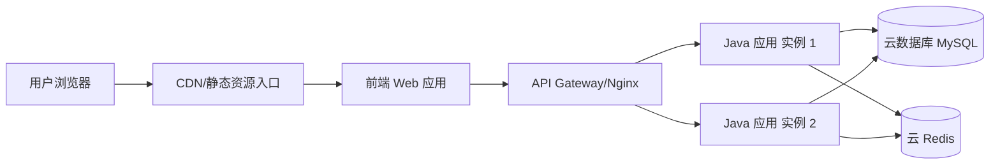

# 部署架构设计经验

部署架构用于描述需求上线后**后端应用与前端应用如何运行**，重点回答：**应用部署在哪里、前端如何部署、入口如何访问、需要多少实例、如何扩缩容和保证高可用**。

## 设计目标

部署架构不等同于应用架构。应用架构关注代码与模块，部署架构关注应用运行时拓扑。技术方案开始前必须先让用户在三种部署架构处理方式中选择；若用户选择「部署架构不变，无需设计」，部署架构章节默认写不变即可。

**边界说明**：部署架构不需要设计数据库、缓存、MQ、对象存储等基础设施本身如何部署，这些默认使用云服务。部署架构只需说明应用/前端如何连接或依赖这些云服务，不展开云服务底层部署。

## 强规约

以下规则属于硬性约束，生成技术方案时必须遵守，不得与「常见设计经验」混淆。

1. **设计前必须让用户选择部署架构处理方式**：每次开始设计技术方案时，都必须让用户在以下三项中选择一项：① **重新设计部署架构**；② **部署架构不变，无需设计**；③ **部署架构要调整**。
2. **部署架构要调整时必须追问思路**：若用户选择「部署架构要调整」，必须要求用户给出调整思路，例如新增/调整后端应用实例、前端应用入口、网关路由、域名、端口、配置项、监控告警、扩缩容或高可用策略等。
3. **部署架构不变时默认写不变**：若用户选择「部署架构不变，无需设计」，技术方案的「部署架构」章节默认只写明「部署架构不变，无新增应用/前端部署实例，复用现有部署架构」，不展开详细部署拓扑与云服务依赖设计。
4. **不设计基础设施底层部署**：数据库、缓存、MQ、对象存储、搜索引擎等默认使用云服务，不设计其集群、节点、副本、磁盘、网络等底层部署架构。
5. **重新设计或调整时必须说明应用/前端运行拓扑**：当用户选择「重新设计部署架构」或「部署架构要调整」时，需要用图或表说明后端应用、前端应用、网关/入口与云服务之间的访问关系。
6. **必须明确实例数量**：重新设计或调整时，必须明确每个后端应用、前端应用的部署实例数量（如 1 个、2 个、N 个），以及是否支持水平扩容。
7. **必须说明访问入口**：需要说明域名、网关路由、负载均衡、前端访问路径、后端 API 访问路径等。
8. **必须说明配置项**：新增或修改配置项必须列出名称、环境、用途、是否敏感；敏感配置不得填写真实值。
9. **必须说明环境差异**：dev / test / prod 的应用实例数、域名、网关路由、前端部署入口、云服务连接配置等差异必须说明。
10. **外部依赖必须说明失败策略**：第三方服务调用必须说明超时、重试、熔断/降级、失败后的业务处理。
11. **部署架构不得替代数据库设计**：部署架构只说明应用如何依赖云数据库，表结构、DDL、索引仍必须放在「数据库设计」章节。

## 必选内容

### 1. 应用/前端部署拓扑

应说明本需求涉及的后端应用、前端应用及访问关系，可使用 Mermaid 或表格。

示例：



### 2. 应用实例清单

必须明确应用与前端实例数量：

| 应用 | 类型 | 部署方式 | 实例数量 | 访问入口 | 是否新增 | 说明 |
|------|------|----------|----------|----------|----------|------|
| Java 应用 | 后端服务 | ECS / K8s / 云应用平台 | 2 | `/api/**` | 否/是 | 支持水平扩容 |
| Admin Web | 前端应用 | CDN + 静态托管 / Nginx | 1 | `https://admin.xxx.com` | 否/是 | 管理端 |
| H5 Web | 前端应用 | CDN + 静态托管 | 1 | `https://m.xxx.com` | 否/是 | 移动端 |

### 3. 云服务依赖

只说明应用依赖哪些云服务及用途，不设计云服务本身部署：

| 云服务 | 用途 | 连接方 | 变更 |
|--------|------|--------|------|
| 云数据库 MySQL | 持久化业务表 | Java 应用 | 新增表/字段/索引 |
| 云 Redis | 缓存、幂等、分布式锁 | Java 应用 | 新增 key 规则 |
| 云 MQ | 异步事件消费 | Java 应用 / 监听器 | 新增 topic/tag |
| 云对象存储 | 文件存储 | Java 应用 / 前端 | 新增 bucket/path |
| 第三方服务 | 外部能力 | Java 应用 | 新增配置/鉴权 |

### 4. 配置项

部署架构必须说明新增或修改的配置项：

| 配置项 | 所属环境 | 示例值 | 说明 | 是否敏感 |
|--------|----------|--------|------|----------|
| `xxx.api.url` | dev/test/prod | `https://api.xxx.com` | 第三方 API 地址 | 否 |
| `xxx.api.secret` | dev/test/prod | `***` | 第三方密钥 | 是 |
| `redis.key.prefix` | all | `app:feature:` | Redis key 前缀 | 否 |

敏感配置只写名称和用途，不写真实值。

### 5. 环境差异

应说明 dev / test / prod 的差异，例如：

- 后端应用实例数量是否不同
- 前端域名是否不同
- API 网关路由是否不同
- 第三方服务是否使用沙箱
- 云数据库 / 云 Redis / 云 MQ 连接配置是否隔离
- 定时任务是否只在部分环境开启

### 6. 高可用与扩缩容

如果需求引入新应用或高流量接口，需说明：

- 后端应用是否无状态，是否支持水平扩容
- 后端应用部署多少个实例，是否需要至少 2 个实例保证高可用
- 前端是否通过 CDN/静态托管提供高可用访问
- 是否需要限流、熔断、重试
- 是否有幂等设计

### 7. 监控与告警

根据需求复杂度补充：

| 指标 | 说明 |
|------|------|
| 后端接口 QPS / RT / 错误率 | 核心 API 监控 |
| 应用实例 CPU / 内存 | 后端应用运行状态 |
| 前端访问量 / 错误率 | 前端运行状态 |
| MQ 消费堆积 | 异步消费监控 |
| 第三方调用失败率 | 外部依赖稳定性 |
| 业务指标 | 如创建成功率、支付成功率 |

### 8. 部署架构不变说明

如果用户选择「部署架构不变，无需设计」，部署架构章节默认写不变即可，不需要展开详细部署拓扑与云服务依赖设计。推荐写法：

```text
部署架构不变，无新增应用/前端部署实例，复用现有部署架构。
```

若本次虽然部署架构不变，但存在新增配置项、数据库表、MQ topic/tag、Redis key 或第三方依赖，应在对应的「数据库设计」「第三方依赖」「其他」章节说明，不在部署架构章节展开。

## 常见设计经验

### 经验 1：部署架构重点看应用和前端，不看云服务底层

不要设计云数据库、云 Redis、云 MQ 的底层集群部署。默认使用云服务，只说明应用如何依赖它们。

### 经验 2：实例数量必须明确

部署架构不能只写“部署 Java 应用”或“部署前端”，必须写清楚：

- 后端应用部署几个实例
- 前端应用部署几个入口/站点
- 是否支持水平扩容
- 是否需要高可用多实例

### 经验 3：部署架构要和模块变更清单对应

如果模块变更清单中有 适配层监听器、定时任务、第三方 SDK、前端 UI 工程等，部署架构中应体现相应应用入口或前端入口。

### 经验 4：部署不变就不要展开

如果用户选择部署架构不变，部署架构章节默认写“不变”即可，不要强行展开详细部署拓扑。

### 经验 5：外部依赖的失败策略要前置设计

第三方服务调用需要提前考虑：

- 超时时间
- 重试策略
- 熔断/降级
- 失败后的业务处理
- 密钥配置方式

## 自检清单

- [ ] 是否已让用户在三种部署架构处理方式中选择？
- [ ] 如果用户选择「部署架构不变，无需设计」，是否默认写明「部署架构不变，无新增应用/前端部署实例，复用现有部署架构」且未展开详细部署设计？
- [ ] 如果用户选择重新设计或调整，是否说明后端应用、前端应用运行拓扑？
- [ ] 是否明确每个后端应用和前端应用的实例数量？
- [ ] 是否说明域名、网关路由、访问入口？
- [ ] 是否仅说明云服务依赖，而没有设计云服务底层部署？
- [ ] 是否说明新增/修改配置项？
- [ ] 是否说明 dev/test/prod 环境差异？
- [ ] 是否说明扩缩容、高可用、限流、重试、幂等等运行保障？
- [ ] 部署架构是否与模块变更清单、数据库设计、第三方依赖设计一致？
