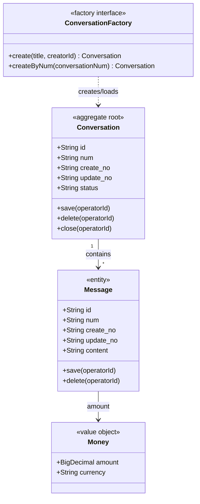

# Domain Model Design Specification

## Core Requirements

### Basic Attributes and Mandatory Actions (强制)

- **Basic attributes (Aggregate Roots and Entities MUST have)**:
  - **id**: BIGINT AUTO_INCREMENT primary key in DB, Long in Java
  - **num**: Business ID for external display/deduplication
  - **create_no**: Creator ID (e.g., userId)
  - **update_no**: Last updater ID (e.g., userId)
- **Value Objects**: No above attributes, only business properties
- **Mandatory domain actions**: All aggregates and entities with persistence lifecycle MUST implement:
  - **save(…, operatorId)**: Save/update current state; operatorId required for audit
  - **delete(…, operatorId)**: Logical/physical delete; operatorId required

### Operator Parameter Rule

**ALL** domain actions (including save, delete, and all business methods) **MUST include operatorId parameter** for audit and traceability.

---

## Domain Class Diagram (Mermaid Example)

领域类图必须包含聚合根、实体、值对象，以及对应的领域工厂（Factory）。领域对象的创建、加载统一通过 Factory 完成，application 层不得直接 `new` 领域对象，也不得直接调用领域对象静态 `create` 方法构建对象。

---

## Domain Objects Classification

| Type | Definition | Key Indicator | Basic Attributes | Mandatory Actions | Example |
|------|-----------|---------------|-------------------|-------------------|---------|
| **Aggregate Root** | Aggregate entry, unique ID, maintains invariants | Independent lifecycle, referenced by ID externally | id, num, create_no, update_no | save(operatorId), delete(operatorId) | User, Order, Conversation |
| **Entity** | Has unique ID, belongs to aggregate, may have lifecycle | Distinguishable by ID within aggregate | id, num, create_no, update_no | save(operatorId), delete(operatorId) | OrderItem, FamilyMember, Message |
| **Value Object** | No standalone ID, defined by property values; **immutable** | Replaceable, equality comparable, no independent lifecycle | None (business properties only) | None | Money, DateRange, Address, CategoryId |

---

## Domain Factory Design

### Factory Requirements

- **Every aggregate root MUST have a corresponding `*Factory` interface** in the domain layer.
- Domain object construction **MUST go through Factory**.
- Application layer **MUST NOT** directly `new` domain objects.
- Application layer **MUST NOT** directly call domain object static `create` methods to construct objects.
- Infra layer implements the Factory interface and may depend on Entity/Mapper/Repository implementation details.

### Factory Method Checklist

For each Factory, specify:

1. **Factory name**: e.g., `ConversationFactory`, `OrderFactory`
2. **Method signature**: exactly two methods only: `create(...)` and `createByNum(...)`
3. **Input parameters**: business attributes for `create(...)`; business code `num` for `createByNum(...)`
4. **Return type**: aggregate root or entity
5. **Responsibility**: both methods build domain objects; `create(...)` builds a new domain object from attributes; `createByNum(...)` loads data through Repository by business code and builds the existing domain object
6. **Dependencies**: Repository/Gateway/Mapper/Entity converters used by infra implementation
7. **Forbidden methods**: do NOT design `createById(...)`, `rebuild(...)`, or any other Factory methods

**Example (Factory Method Table)**:

| Factory | Method | Params | Return | Responsibility | Dependencies |
|---------|--------|--------|--------|----------------|--------------|
| ConversationFactory | create | title, creatorId | Conversation | Build a new Conversation domain object from attributes | NumGenerator |
| ConversationFactory | createByNum | conversationNum | Conversation | Load data through Repository by business code and build existing Conversation domain object | ConversationRepository |

---

## Domain Actions Design

For each domain action, specify:

1. **Method signature**: Name, params (MUST include operatorId), return type
2. **Responsibility**: Business meaning in ubiquitous language
3. **Preconditions/Postconditions**: Conditions before/after execution; invariants satisfied
4. **Business rules & validation**: Amount > 0, status transitions, permission checks
5. **Domain events**: Event name, trigger timing, payload fields
6. **Dependencies**: Required Repository/Gateway interfaces

**Example (Domain Action Table)**:

| Aggregate | Domain Action | Responsibility | Preconditions | Postconditions/Rules | Domain Event |
|-----------|----------------|-----------------|---------------|----------------------|--------------|
| Conversation | save(operatorId) | Save/update conversation state | operatorId valid | create_no/update_no updated | — |
| Conversation | delete(operatorId) | Logical/physical delete conversation | operatorId has permission | Marked deleted or physically removed | CONVERSATION_DELETED |
| Conversation | create(title, creatorId) | Create conversation, set creator | creatorId user exists | status=OPEN; id, num, create_no generated | CONVERSATION_CREATED |
| Conversation | close(operatorId) | Close conversation | status=OPEN; operatorId has permission | status=CLOSED | CONVERSATION_CLOSED |

---

## Domain Invariants and Business Rules

- **Invariants**: Conditions aggregate must always satisfy (e.g., "order total = sum of line items")
- **Business Rules**: Validations in preconditions; state/data rules in postconditions
- **Validation Ownership**:
  - Aggregate root validates intra-aggregate data
  - Cross-aggregate existence checks (e.g., bookId validity) may be done by:
    - Application layer pre-query then domain action call
    - Aggregate root depending on Repository interface

---

## Value Objects Usage Scenarios

Finance: Money (amount, currency), DateRange, Percentage
Identification: CategoryId, PaymentMethodId (enumeration-like)
Business categorization: Color, Priority, Status (enum)

Value objects **reduce entity attribute bloat** and **centralize validation logic**.

---

## Domain Events Design

- **When to publish**: After aggregate completes **state change or significant business fact**, e.g., "order created", "session closed"
- **Naming**: Past tense, clear business meaning (ORDER_CREATED, CONVERSATION_CLOSED)
- **Payload**: Event unique ID, aggregate root ID, key attributes, timestamp; minimize sensitive data
- **Registry**: List all domain events (name, trigger, payload fields, optional subscribers) for alignment with impl-facade-module and impl-domain-module

---

## Cross-Aggregate References and Gateways

- **Cross-aggregate**: Only hold **aggregate root ID** (e.g., bookId, familyId), never object references
- **Gateway**: When domain action needs **external capability** (e.g., call AI model, WeChat API, read config), define **Gateway interface** in domain layer (e.g., CategorySuggestGateway, WechatAuthGateway); infra implements; domain depends on interface only

---

## Domain Model Professional Checklist

- [ ] Each **aggregate root** and **entity** has basic attributes: id, num, create_no, update_no (value objects excluded)
- [ ] Each aggregate root has a corresponding **Factory interface** in the domain layer
- [ ] Domain object construction goes through Factory; application does not directly `new` domain objects or call static `create` construction methods
- [ ] Each Factory contains exactly two methods only: `create(...)` and `createByNum(...)`; no `createById(...)`, `rebuild(...)`, or other methods
- [ ] Each aggregate root and persistent entity has **save(…, operatorId)** and **delete(…, operatorId)**
- [ ] **ALL** domain actions include **operatorId parameter**
- [ ] Each aggregate has clear **aggregate root**; boundary has only one root per aggregate
- [ ] Aggregates reference each other **by ID only**, no object references; cross-aggregate coordination via events or application orchestration
- [ ] **Value objects** identified and diagrammed (money, date ranges, enums) to reduce entity attribute bloat
- [ ] Each aggregate root has explicit **invariants** and **key business rules**
- [ ] Domain actions include **preconditions/postconditions** or equivalent business rule descriptions; domain events noted
- [ ] **Key domain actions** have **sequence logic** (internal steps, Repository/Gateway call timing, event publish timing)
- [ ] **Domain event registry** complete; event names and payloads align with facade/domain contracts
- [ ] Naming aligns with PRD/business terms (**ubiquitous language**); no technical implementation details leaked
