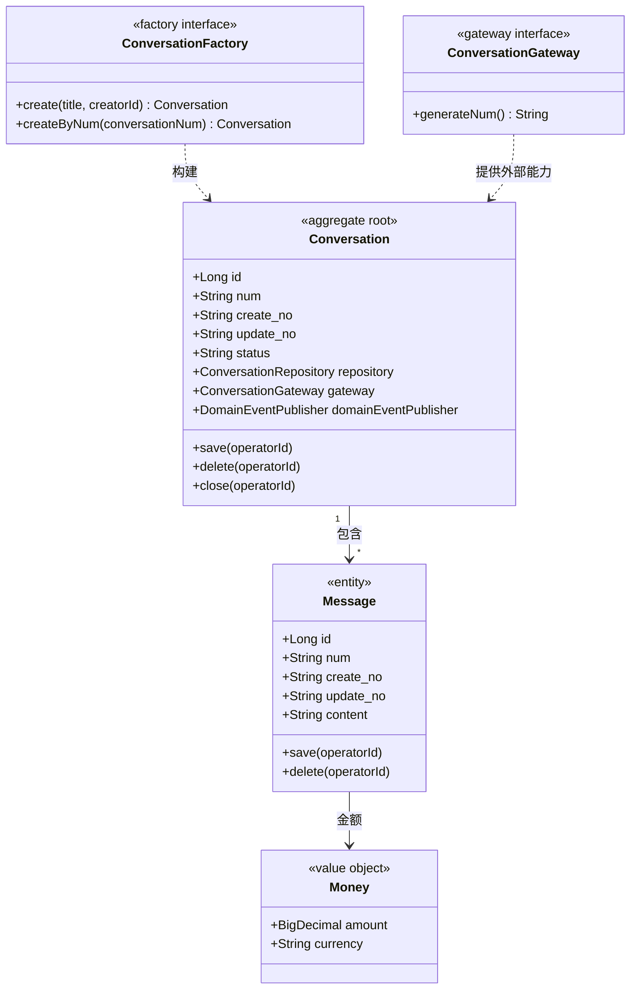

# 领域模型设计规范

本文件用于补充「领域层设计」中的领域模型细节，重点说明聚合根、实体、值对象、领域工厂、领域动作、领域规则、领域网关、领域事件的设计要求。

## 一、核心强规约

### 1. 基本属性与必备动作

- **聚合根和实体必须具备基本属性**：
  - `id`：数据库物理主键，DB 中为 BIGINT 自增，Java 中建议为 Long
  - `num`：业务编码，对外展示、跨层传递、幂等识别优先使用
  - `create_no`：创建人编号
  - `update_no`：最后更新人编号
- **聚合根还必须具备领域协作依赖属性**：
  - `Repository`：本聚合对应的仓储接口，用于持久化协作
  - `Gateway`：本聚合需要的领域网关接口，用于外部能力或跨边界能力
  - `DomainEventPublisher`：领域事件发布器，用于发布领域事件
- **值对象无需这些基本属性和领域协作依赖属性**，只包含业务属性。
- **软删除标记不得出现在领域模型中**：聚合根和领域实体不得包含 `is_deleted`、`deleted`、`isDeleted` 等软删除标记。软删除是持久化实现细节，只能出现在数据库表和 infra Entity 中。
- **聚合根和可持久化实体必须具备必备动作**：
  - `save(..., operatorId)`：保存或更新当前状态，必须带操作人
  - `delete(..., operatorId)`：删除当前对象，必须带操作人

### 2. 操作人参数规则

所有领域动作都必须包含 `operatorId` 参数，包括 `save`、`delete` 以及其他业务动作。

### 3. 领域工厂规则

- 每个聚合根必须有对应 `*Factory` 接口。
- Factory 接口定义在 domain 层。
- FactoryImpl 实现在 infra 层。
- Factory **只能包含两个方法**：
  - `create(...)`：根据属性构建新的领域对象
  - `createByNum(...)`：根据业务编码 `num` 通过 Repository 获取数据并构建既有领域对象
- 禁止设计 `createById(...)`、`rebuild(...)` 或其他任何工厂方法。
- application 层不得直接 `new` 领域对象，也不得直接调用领域对象静态 `create` 方法构建对象。

### 4. 领域网关规则

- 领域网关 Gateway 接口必须定义在 domain 层。
- GatewayImpl 必须实现在 infra 层。
- domain 只依赖 Gateway 接口，不依赖 infra 实现。
- Gateway 用领域语言表达领域所需外部能力，例如编号生成、第三方服务能力、跨系统协作能力等。

### 5. Repository 规则

Repository 是领域对象 / Factory 与 infra 的持久化协作接口，不是 application 查询入口。

Repository 只能包含三个方法：

```java
void save(R aggregate);
R findByNum(String num);
void deleteByNum(String num);
```

禁止增加 `findById`、`findByEmail`、列表查询、分页查询、统计查询等方法。

## 二、领域类图示例

领域类图必须包含聚合根、实体、值对象，以及对应的领域工厂和领域网关。



## 三、领域对象分类

| 类型 | 定义 | 识别标准 | 基本属性 | 必备动作 | 示例 |
|------|------|----------|----------|----------|------|
| 聚合根 | 聚合入口，维护聚合内一致性 | 生命周期独立，对外通过 ID/num 引用 | id、num、create_no、update_no、Repository、Gateway、DomainEventPublisher | save、delete | User、Order、Conversation |
| 实体 | 有唯一标识，属于某个聚合 | 在聚合内可通过 ID 区分 | id、num、create_no、update_no | save、delete | OrderItem、FamilyMember、Message |
| 值对象 | 无独立身份，由属性值定义 | 可替换、可比较、无独立生命周期 | 无 | 无 | Money、DateRange、Address |

## 四、领域动作设计

每个领域动作都必须说明：

1. **方法签名**：方法名、参数、返回值；参数必须包含 `operatorId`
2. **职责**：用业务语言描述动作含义
3. **前置条件**：执行前必须满足的条件
4. **后置结果**：执行后状态、字段、事件的变化
5. **业务规则**：金额、状态、权限、数量等约束
6. **领域事件**：触发事件名、触发时机、载荷字段
7. **依赖接口**：需要使用的 Repository / Gateway

示例：

| 聚合 | 领域动作 | 职责 | 前置条件 | 后置条件/规则 | 领域事件 |
|------|----------|------|----------|---------------|----------|
| Conversation | save(operatorId) | 保存会话状态 | operatorId 合法 | create_no/update_no 更新 | CONVERSATION_SAVED |
| Conversation | delete(operatorId) | 删除会话 | 操作人有权限 | 标记删除或物理删除 | CONVERSATION_DELETED |
| Conversation | close(operatorId) | 关闭会话 | 状态为 OPEN | 状态变为 CLOSED | CONVERSATION_CLOSED |

## 五、领域规则设计

领域规则用于描述聚合内不变性和关键业务约束。

| 聚合/对象 | 规则类型 | 规则描述 | 违反时表达 |
|-----------|----------|----------|------------|
| Conversation | 状态规则 | 只有 OPEN 状态可以关闭 | 抛业务异常 |
| Order | 金额规则 | 订单总金额必须等于明细金额之和 | 抛业务异常 |

规则归属建议：

- 聚合内一致性由聚合根负责。
- 跨聚合存在性校验可由 application 调 QueryService 后再调用领域动作。
- 外部能力通过 Gateway 接口表达。

## 六、领域工厂设计

### 1. Factory 方法固定为两个

| Factory | 方法 | 入参 | 返回值 | 职责 | 依赖 |
|---------|------|------|--------|------|------|
| ConversationFactory | create | title, creatorId | Conversation | 根据属性构建新的 Conversation 领域对象 | ConversationGateway |
| ConversationFactory | createByNum | conversationNum | Conversation | 根据业务编码通过 Repository 获取数据并构建既有 Conversation 领域对象 | ConversationRepository |

强制要求：

- Factory 只允许 `create(...)` 与 `createByNum(...)` 两个方法。
- 两个方法都用于构建领域对象。
- `create(...)` 不做复杂业务编排。
- `createByNum(...)` 通过 Repository 的 `findByNum(num)` 获取数据。
- 不允许 `createById(...)`、`rebuild(...)` 或其他方法。

## 七、领域网关设计

领域网关用于表达领域层需要的外部能力或跨边界协作能力。

| Gateway | 方法 | 入参 | 返回值 | 职责 | 实现位置 |
|---------|------|------|--------|------|----------|
| ConversationGateway | generateNum | 无 | String | 生成会话业务编码 | infra |
| PaymentGateway | pay | PaymentParam | PaymentResult | 支付能力 | infra |

强制要求：

- Gateway 接口定义在 domain 层。
- GatewayImpl 实现在 infra 层。
- domain 不依赖具体 SDK、HTTP client、Mapper 或 Redis 等基础设施实现。
- Gateway 方法命名应使用领域语言，不要直接暴露第三方 API 语义。

## 八、领域事件设计

领域事件表示已经发生的业务事实。

| 事件名 | 触发时机 | 载荷要点 | 可订阅方/用途 |
|--------|----------|----------|----------------|
| CONVERSATION_CLOSED | 会话关闭成功 | conversationNum, operatorId, closeTime | 通知、审计 |
| ORDER_PAID | 订单支付成功 | orderNum, userNum, amount | 通知、积分 |

事件设计建议：

- 事件命名使用过去式或业务事实表达。
- 事件载荷应包含必要业务标识，避免包含敏感信息。
- 事件应与 facade/domain 事件契约对齐。

## 九、跨聚合引用与外部协作

- 跨聚合只保存聚合根 ID 或业务编码，不直接持有对象引用。
- 跨聚合查询或存在性校验由 application 调 QueryService 完成。
- 外部能力由 domain Gateway 接口表达，infra 实现。

## 十、专业自检清单

- [ ] 每个聚合根和实体是否有 id、num、create_no、update_no？
- [ ] 每个聚合根是否持有 Repository、Gateway、DomainEventPublisher 三类领域协作依赖属性？
- [ ] 聚合根和领域实体中是否没有 is_deleted/deleted/isDeleted 等软删除标记？
- [ ] 每个聚合根和可持久化实体是否有 save/delete？
- [ ] 所有领域动作是否包含 operatorId？
- [ ] 是否按领域模型、领域动作、领域规则、领域工厂、领域网关、领域事件组织？
- [ ] 每个聚合根是否有且仅有一个 Factory？
- [ ] 每个 Factory 是否只包含 create(...) 与 createByNum(...)？
- [ ] create(...) 与 createByNum(...) 是否都用于构建领域对象？
- [ ] 是否设计了领域网关 Gateway，且定义在 domain、实现在 infra？
- [ ] Repository 是否只有 save/findByNum/deleteByNum？
- [ ] 聚合之间是否只通过 ID/num 引用？
- [ ] 是否没有在 domain 中出现 Mapper、Entity、MyBatis、Redis、HTTP client 等基础设施实现？
- [ ] 每个关键领域动作是否有时序图？
- [ ] 领域事件是否完整列出并与业务事实一致？
